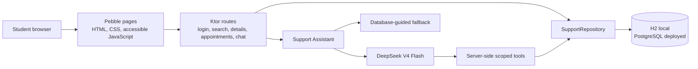

# System architecture

The prototype is a server-rendered Kotlin application. Pebble keeps the interface usable without a large client framework, while small JavaScript modules add the persistent font preference and chat interaction.

## Request flow

1. The demonstration login creates a server session for the seeded user.
2. Pebble templates render the current database state.
3. Search matches the student's own wording against facility text, category names, and taxonomy keywords.
4. Appointment mutations validate the current user, facility, slot, and booking status inside a database transaction.
5. Chat sends recent user-scoped context to the assistant.
6. DeepSeek may request a named tool. The server validates the arguments, injects the current user, executes the repository call, and returns only the tool result.
7. If no AI key is configured, a deterministic repository-backed assistant supplies basic routing guidance.

## Security boundaries

- The API key and database credentials stay in server environment variables.
- No AI tool accepts a `user_id`; the server supplies it from the authenticated session.
- Booking and cancellation require explicit confirmation language in the model prompt.
- Appointment reads and writes are filtered by the current user.
- Tool arguments are parsed and validated before repository execution.
- The assistant is constrained to routing support and is told not to diagnose.

## Accessibility architecture

- Pages use semantic headings, landmarks, labels, description lists, and native form controls.
- The chat panel is a labelled non-modal dialog with focus management, Escape support, and an aria-live log.
- The large-font preference is stored in `localStorage` and applied at document start after refresh.
- CSS focus styles, skip links, and AA contrast are shared across routes.
- CI tests rendered routes with Playwright and axe, while the research plan also calls for participant testing with assistive technology.
