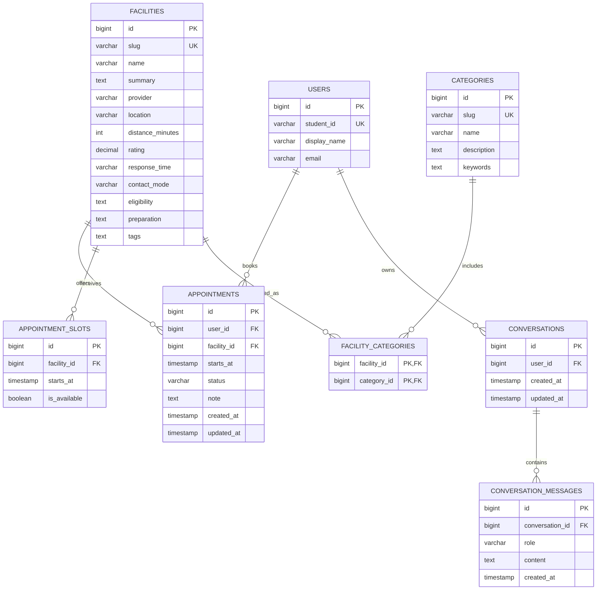

# Database entity-relationship diagram

The schema supports overlapping categories through a many-to-many relationship between facilities and categories. Appointment slots are separate from appointments so availability can be changed transactionally. Conversations are linked to the current demo user, not to a client-supplied identity.

## Why this structure fits the research

- `FACILITY_CATEGORIES` allows one service to belong to several need areas, representing the overlap seen in T04–T07 rather than forcing one false category.
- searchable category `keywords` let students use their own vocabulary, supporting T01–T03.
- facility scope and access fields hold the comparison details requested in T08–T15 and T19.
- slots and appointment status support confirmation, review, and cancellation in T16–T18.
- conversation history lets the guide retain the student's current decision context without exposing unrelated users.
